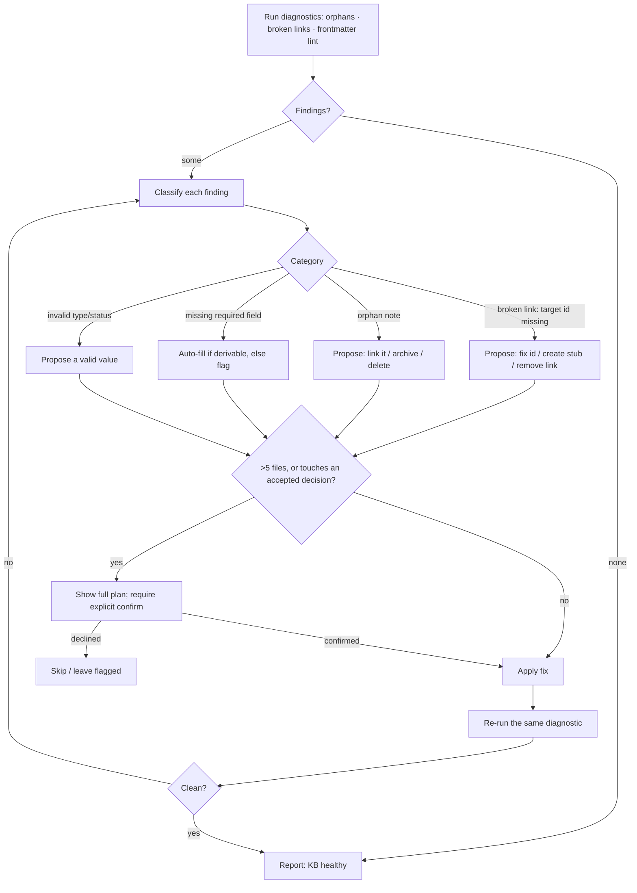

# Jarvis Doctor — diagnostics & fix recipes (rg-only)

No persisted index. Every check is `rg` over the live tree, run from the KB root. Markdown only (`-g '*.md'`). The detect → classify → fix → verify loop is the Mermaid diagram at the bottom — read it before applying any fix.

## Orphans (no inbound and no outbound links)

```bash
# ids that ARE linked to (appear as [[...]] somewhere)
rg -o -I '\[\[([0-9A-Za-z:_-]+)' -or '$1' -g '*.md' | sort -u > /tmp/linked_to.txt

for f in $(rg -l '^id:' -g '*.md'); do
  id=$(rg -m1 '^id:[[:space:]]*(\S+)' -or '$1' "$f")
  has_out=$(rg -c '\[\[' "$f" || true)
  is_linked=$(grep -Fxq "$id" /tmp/linked_to.txt && echo 1 || echo 0)
  if [ "${has_out:-0}" = "0" ] && [ "$is_linked" = "0" ]; then echo "ORPHAN: $f"; fi
done
```

Fix options: link it to/from related notes, archive it (`status: archived`), or (with confirm) delete it via `jarvis-index`.

## Broken wikilinks (point at an id that doesn't exist)

```bash
rg -o -I '\[\[([0-9A-Za-z:_-]+)' -or '$1' -g '*.md' | sort -u > /tmp/targets.txt
rg -I '^id:[[:space:]]*(\S+)' -or '$1' -g '*.md' | sort -u > /tmp/ids.txt
comm -23 /tmp/targets.txt /tmp/ids.txt   # link targets with no matching note = broken
```

Fix options: correct the id typo, create a stub note for the target, or remove the dangling link.

## Frontmatter lint (required fields)

Universal required fields — flag any note missing one:
```bash
for f in $(rg -l '.' -g '*.md'); do
  for field in id title type status created; do
    rg -q "^$field:" "$f" || echo "MISSING $field: $f"
  done
done
```

Plus per-type extras (beyond id/title/type/status/created/updated):

| type | extra required |
|------|----------------|
| project | `team`, `owner` |
| team | `owner` (lead) |
| org | — |
| reference | — |
| decision | `owner` recommended; body should have Context / Decision / Consequences |

And validate `type` ∈ {project, org, team, reference, decision} and `status` against the type's lifecycle (project: draft→active→blocked→done→archived; org/team/reference: draft→active→archived; decision: proposed→accepted→superseded). **Accepted decisions are immutable.**

## Refactor dry-run (taxonomy moves / id merges) — high blast radius

Always dry-run first: list every file that would move and every `[[id]]` link that would need rewriting; confirm with the user; then apply.
- Moving a note between folders is free (type is in frontmatter). If `type:` itself changes, re-validate required fields for the new type.
- Renaming/merging ids: rewrite all inbound wikilinks; the broken-link check above must come back clean afterwards.

## Fix application & verification

For every applied fix, **re-run the same diagnostic** that surfaced the finding. The KB is clean for that check only when the re-run is empty. If findings remain, re-classify and repeat (the loop below).

## Result presentation
Report: `finding · file · proposed fix · (applied | left-flagged | needs-confirm)`. Don't dump full note bodies.


