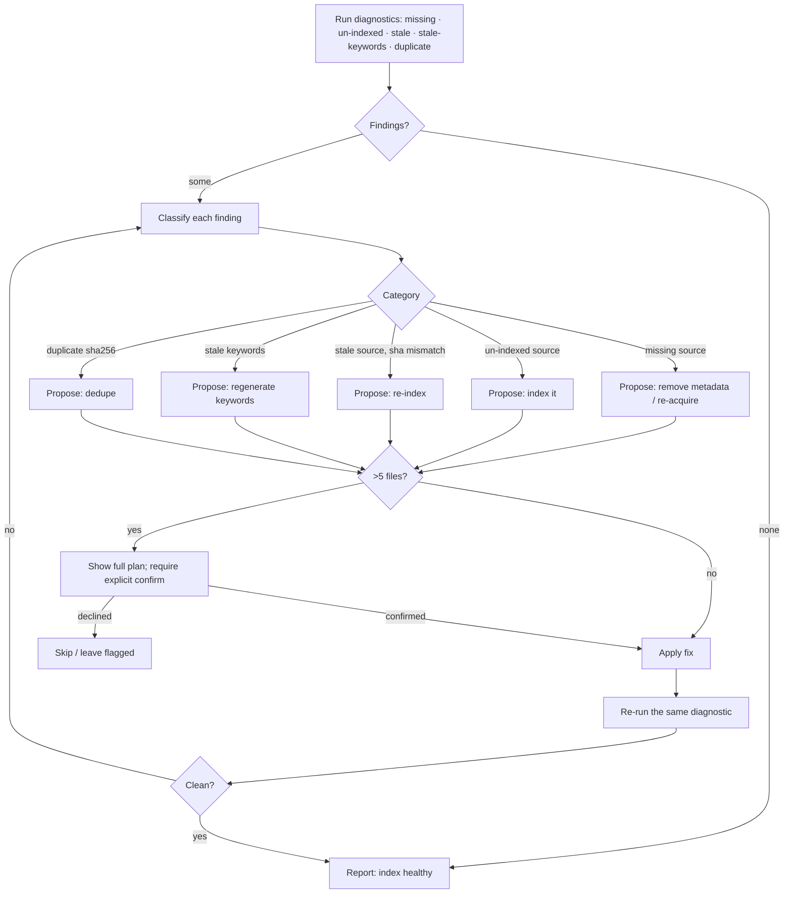

# Jarvis Doctor — diagnostics & fix recipes (rg/shell)

No persisted index. Every check runs over `metadata/` and `sources/` from the index root. The detect → classify → fix → verify loop is the Mermaid diagram at the bottom — read it before applying any fix.

## Missing source (metadata refs a deleted original)
```bash
for f in metadata/*.md; do
  p=$(rg -m1 '^[[:space:]]*path:[[:space:]]*(.+)$' -or '$1' "$f")
  [ -n "$p" ] && [ ! -e "$p" ] && echo "MISSING SOURCE: $f -> $p"
done
```
Fix: remove the orphaned metadata (confirm), or re-acquire the source and re-index.

## Un-indexed source (sources/ entry with no metadata)
```bash
for d in sources/*/; do
  id=$(basename "$d")
  ls metadata/"$id"-*.md >/dev/null 2>&1 || echo "UN-INDEXED: $d"
done
```
Fix: index it via `jarvis-index`.

## Stale source (sha256 mismatch — original changed)
```bash
for f in metadata/*.md; do
  p=$(rg -m1 '^[[:space:]]*path:[[:space:]]*(.+)$' -or '$1' "$f")
  want=$(rg -m1 '^[[:space:]]*sha256:[[:space:]]*(\S+)' -or '$1' "$f")
  [ -n "$p" ] && [ -e "$p" ] && [ -n "$want" ] && {
    got=$(sha256sum "$p" | cut -d' ' -f1)
    [ "$got" != "$want" ] && echo "STALE: $f (source changed)"
  }
done
```
Fix: re-index the source (re-extract + regenerate keywords).

## Stale keywords
Sources flagged "Stale source" need `keywords:` regenerated too. Also flag metadata missing `index_generated:`:
```bash
for f in metadata/*.md; do
  rg -q '^index_generated:' "$f" || echo "NO KEYWORDS: $f"
done
```
Fix: regenerate SIRA keywords (`jarvis-index` / `references/sira-index.md`).

## Duplicate source (same sha256 twice)
```bash
for f in metadata/*.md; do
  rg -m1 '^[[:space:]]*sha256:[[:space:]]*(\S+)' -or '$1' "$f"
done | sort | uniq -d | while read -r h; do
  echo "DUPLICATE sha256: $h"
  rg -l "sha256:[[:space:]]*$h" metadata/
done
```
Fix: dedupe — keep one metadata+source pair, remove the other (confirm).

## Fix application & verification
For every applied fix, **re-run the same check** that surfaced the finding. The index is clean for that check only when the re-run is empty. If findings remain, re-classify and repeat (the loop below).

## Result presentation
Report: `finding · file/source · proposed fix · (applied | left-flagged | needs-confirm)`. Don't dump full metadata bodies.


